# Анализ экзаменационной кампании 2024

## Цель работы

Исследовать взаимосвязь между факторами образовательного процесса и итоговой успеваемостью студентов, а также разработать и сравнить модели машинного обучения для классификации уровня успеваемости на основе этих факторов.

# Анализ факторов успеваемости студентов

Учебный проект по прикладному машинному обучению: разведочный анализ данных, кластеризация и классификация на датасете **Student Performance Factors**.

## Датасет

Используется датасет `StudentPerformanceFactors.csv`, содержащий факторы, влияющие на итоговый балл за экзамен (`Exam_Score`): часы учёбы, посещаемость, сон, мотивация, участие родителей, доход семьи и др.

## Что делает проект

### 1. Разведочный анализ данных (EDA)
- Описательная статистика количественных и категориальных признаков
- Анализ пропусков
- Визуализация связей между признаками и итоговым баллом (heatmap корреляций, boxplot, scatter, stripplot)

### 2.Кластеризация (без учителя)

- Нормализация данных (MinMaxScaler)
- Иерархическая кластеризация (дендрограммы)
- K-Means (метод локтя)
- DBSCAN, агломеративная кластеризация
- Сравнение методов по метрикам: silhouette score, Calinski-Harabasz, Davies-Bouldin

### 3.Классификация

Целевая переменная `knowledge_assessment` строится из `Exam_Score` в двух вариантах:

### 3. Классификация (с учителем)
Целевая переменная `knowledge_assessment` строится из `Exam_Score` в двух вариантах:

- **2 класса**: низкий / высокий балл (порог 70)
- **3 класса**: низкий / средний / высокий балл

Модели: логистическая регрессия, дерево решений, случайный лес, градиентный бустинг.

Для борьбы с дисбалансом классов сравниваются несколько подходов:

- `RandomOverSampler`
- `SMOTE`

## 1.EDA

Этот набор данных содержит информацию об академической успеваемости, образе жизни и социально-экономических факторах, связанных со студентами, в том числе об их результатах на экзаменах.

Он включает в себя данные о времени, потраченном на учебу, посещаемости, продолжительности сна, мотивации, дополнительных занятиях, участии родителей, типе учебного заведения и других факторах окружающей среды.

Целевой переменной является Exam_Score, которая отражает итоговую оценку студента на экзамене

Переменные:

``` 'Hours_Studied' - часы обучения (количественная)
'Attendance' - Посещаемость (количественная)
'Parental_Involvement' - «Участие родителей» (категориальная Medium, High, Low)
'Access_to_Resources' - «Доступ к ресурсам» (категориальная Medium, High, Low)
'Extracurricular_Activities' - «Внеклассные мероприятия» (категориальная YES, NO)
'Sleep_Hours', - «Часы сна» (количественная)
'Previous_Scores' - «Предыдущие оценки» (количественная)
'Motivation_Level' - «Уровень мотивации» (категориальная Medium, High, Low)
'Internet_Access', - «Доступ к интернету» (категориальная YES, NO)
'Tutoring_Sessions' - «Репетиторские занятия» (количественная)
'Family_Income', - «Доход семьи» (категориальная Medium, High, Low)
'Teacher_Quality' - «Квалификация учителя» (категориальная Medium, High, Low)
'School_Type', - «Тип школы» (категориальная Public, Private)
'Peer_Influence' - «Влияние сверстников» (категориальная Positive, Neutral, Negative)
'Physical_Activity', - «Уровень активность» (количественная)
'Learning_Disabilities', - «Нарушения обучаемости» (категориальная YES, NO)
'Parental_Education_Level' - «Уровень образования родителей» (категориальная High School, College, Postgraduate)
'Distance_from_Home', - «Расстояние от дома» (категориальная Near, Moderate, Far - Ближний, Средний, Дальний)
'Gender', - Пол (категориальная Male, Female)
'Exam_Score' - «Результаты экзаменов» (количественная)
```

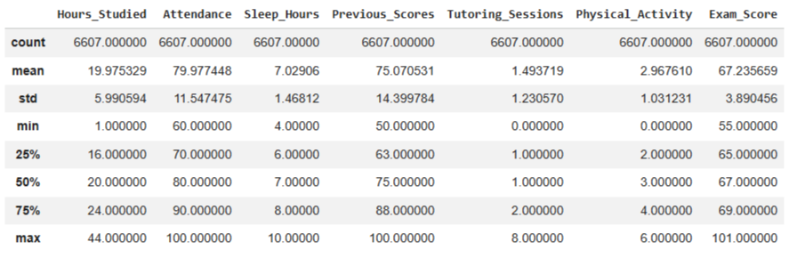

- Студенты в среднем спят по 7 часов
- Среднее значение экзаменов 67 баллов, максимальный балл 101, минимальный 55
- В данной выборке 235 пропусков (78 пропусков по параметру Teacher_Quality, 90 пропусков по параметру Parental_Education_Level, 67 пропусков по параметру Distance_from_Home) => у 4 студентов учителя и родители без образования

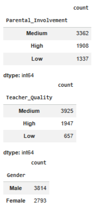

Имеется положительная корреляционная зависимость между Результатами экзаменов и Посещаемостью и Результатами экзаменов и Часами обучения

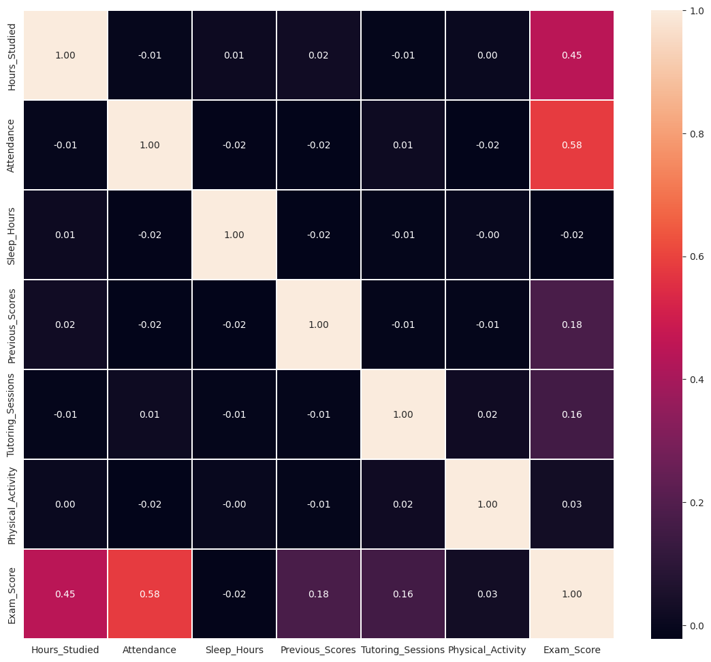

сновываясь на графиках "ящик с усами" для результатов экзаменов, средние баллы у мужчин и женщин схожи. Однако, у женщин наблюдается большее количество аномально высоких результатов (выбросов), а также больше студенток получили баллы выше 90.

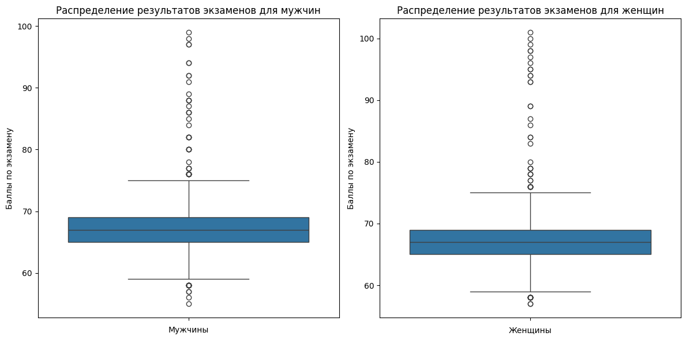
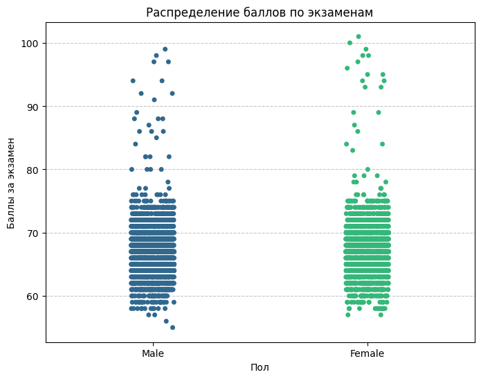

На этом точечном графике (stripplot) видно, что распределение баллов за экзамены у мужчин и женщин в целом схоже, с большинством студентов, набирающих средние баллы. Однако, как и на графиках «ящик с усами», здесь также заметно, что среди женщин больше индивидуальных высоких результатов, которые распределены шире в верхней части шкалы, тогда как у мужчин результаты кажутся более сосредоточенными вокруг среднего.

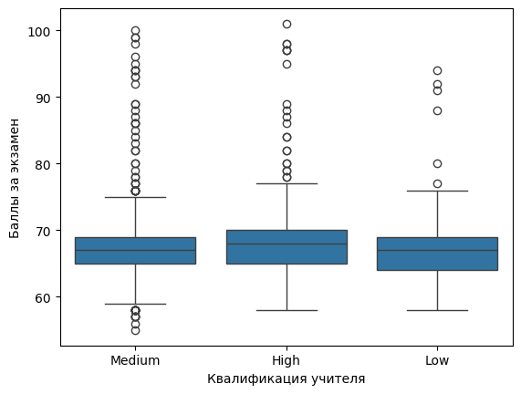

На графике "ящик с усами" видно, что существует четкая зависимость между квалификацией учителя и баллами за экзамены. Ученики, чьи учителя имеют "Высокую" квалификацию, показывают заметно более высокие средние баллы и более узкое распределение результатов, что указывает на стабильно хорошую успеваемость. Студенты с учителями "Средней" квалификации демонстрируют средние баллы, а с "Низкой" квалификацией — самые низкие средние баллы. Это подтверждает, что качество преподавания является значимым фактором, влияющим на успеваемость студентов.

Эти признаки напрямую характеризуют уровень усилий и вовлеченности студента в учебный процесс. В кластеризации они позволят сегментировать студентов по их учебному поведению: например, выделить кластеры очень усердных студентов, студентов с умеренной активностью и тех, кто уделяет учебе мало внимания. В классификации Hours_Studied и Attendance будут важными численными предикторами, поскольку они непосредственно влияют на приобретение знаний и, следовательно, на экзаменационные баллы.

### 2.Кластеризация

Для кластеризации были использованы следующие признаки: 'Часы обучения', 'Посещаемость', 'Предыдущие оценки', 'Часы сна', 'Репетиторские занятия', 'Уровень активность' и 'Результаты экзаменов'.
Нормализация проводилась для подготовки данных к кластеризации.

### Исходные данные (до)

| № | Hours_Studied | Attendance | Previous_Scores | Sleep_Hours | Tutoring_Sessions | Physical_Activity | Exam_Score |
| --- | :---: | :---: | :---: | :---: | :---: | :---: | :---: |
| 0 | 23 | 84 | 73 | 7 | 0 | 3 | 67 |
| 1 | 19 | 64 | 59 | 8 | 2 | 4 | 61 |
| 2 | 24 | 98 | 91 | 7 | 2 | 4 | 74 |
| 3 | 29 | 89 | 98 | 8 | 1 | 4 | 71 |
| 4 | 19 | 92 | 65 | 6 | 3 | 4 | 70 |

### Обработанные данные (после)

| № | Hours_Studied | Attendance | Previous_Scores | Sleep_Hours | Tutoring_Sessions | Physical_Activity | Exam_Score |
| --- | :---: | :---: | :---: | :---: | :---: | :---: | :---: |
| 0 | 0.51 | 0.60 | 0.46 | 0.50 | 0.00 | 0.26 | 0.10 |
| 1 | 0.67 | 0.42 | 0.25 | 0.18 | 0.67 | 0.13 | 0.20 |
| 2 | 0.53 | 0.95 | 0.82 | 0.50 | 0.25 | 0.67 | 0.41 |
| 3 | 0.65 | 0.72 | 0.96 | 0.67 | 0.12 | 0.67 | 0.35 |
| 4 | 0.42 | 0.80 | 0.30 | 0.33 | 0.38 | 0.67 | 0.33 |

Дендрограммы были построены с использованием трех различных методов агрегации:

- метод полной связи
- взвешенный метод
- метод Уорда

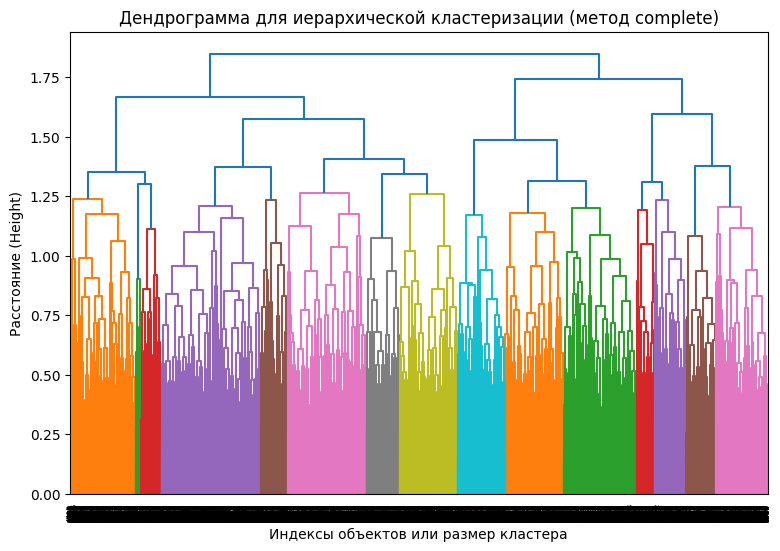

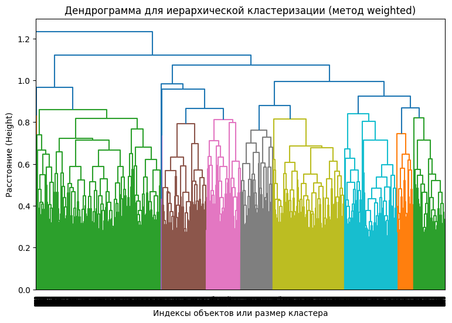

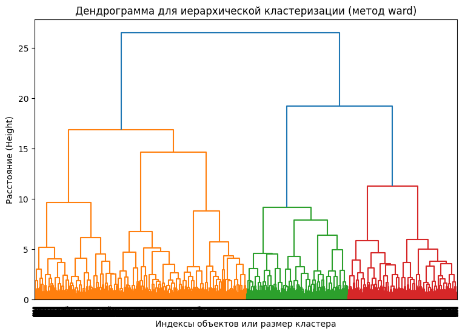

Метод иерархической кластеризации визуально указывают на то, что данные могут быть естественно разделены на 3 или 4 кластера.
На значении K=4 видна точка перегиба => метод логтя определил 4 кластера.

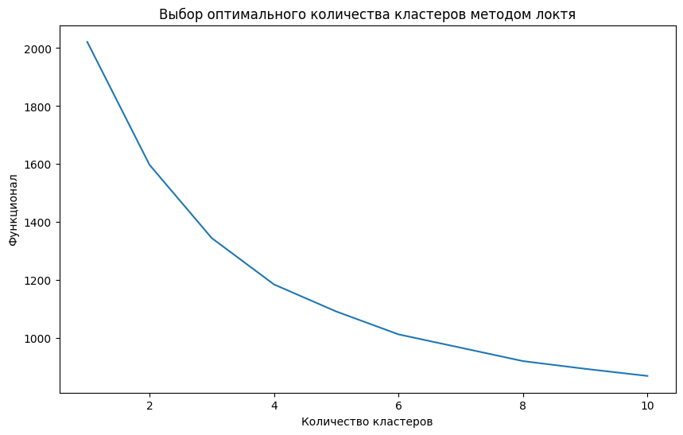

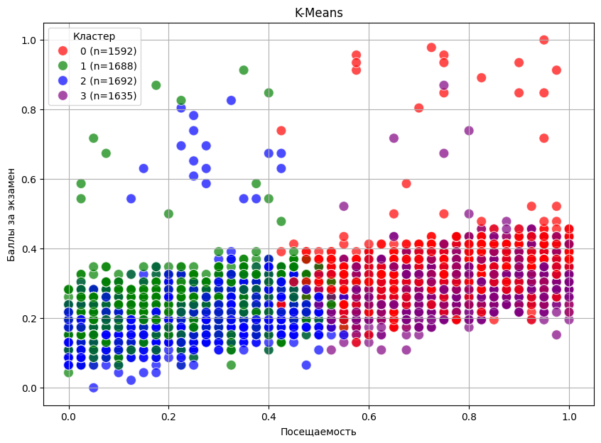

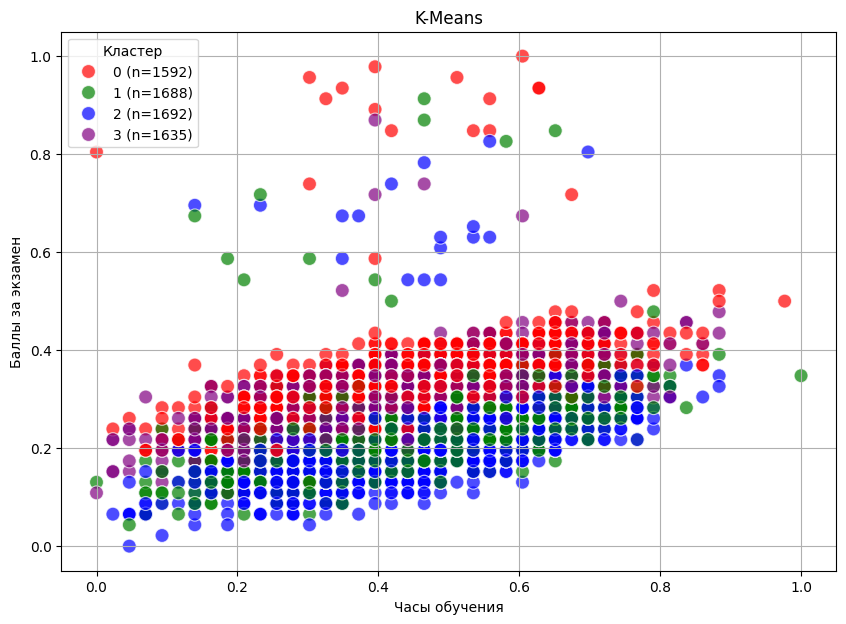

Были получены 4 кластера.

- Ученики с высокой посещаемостью кластеры 0 и 3
- Ученики с низкой посещаемостью кластеры 1 и 2

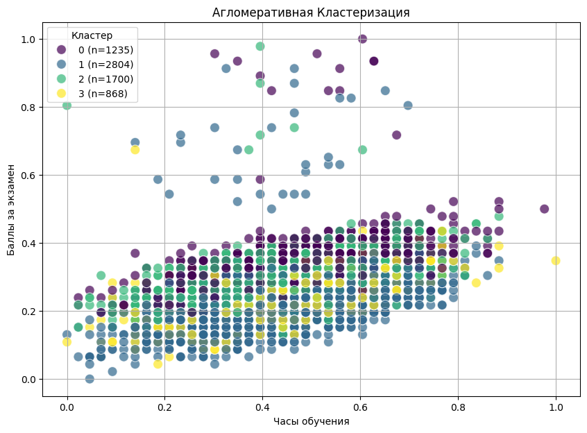

Агломеративная кластеризация выделила 4 группы студентов неравного размера. Кластеры 1 и 2, занимают преимущественно среднюю зону графика и заметно перекрываются между собой. Метод уверенно выделяет крайние группы студентов (сильно успевающих и отстающих), но разделение внутри "среднего" сегмента менее наглядно/

Участники 0 и 2 кластера имеют больше учеников с высокими баллами
Ученики из 3 кластера самые неактивные (с маленькой посещаемостью и часами обучения)

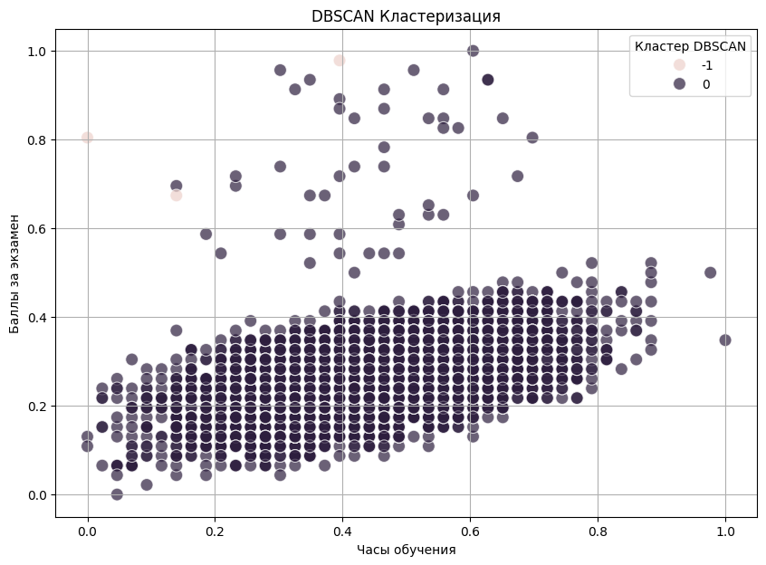

Метод DBSCAN чувствителен к выбору своих ключевых параметров. На рисунке видно, что метод DBSCAN всех учеников определил в 1 кластер, т.к. большинство учеников имеют средние баллы за экзамен. Метод определил учеников с высокими баллами, как шумовых

| № | Метод | Коэффициент силуэта | Индекс Калински-Харабаса | Индекс Дэвиса-Болдуина |
| --- | :---: | :---: | :---: | :---: |
| 0 | K-Means | 0.18 | 155.61 | 1.62 |
| 1 | DBSCAN | 0.29 | 4.30 | 1.74 |
| 2 | Агломеративная Кластеризация | 0.07 | 875.75 | 2.33 |

K-Means показывает наилучшие результаты по метрикам Калински-Харабаса и Дэвиса-Болдуина, что указывает на то, что он формирует наиболее компактные и хорошо разделенные кластеры в целом.

### 3.Многоклассовая классификация

Для многоклассовой классификации результаты экзаменов был разделён следующим образом:

- Класс 0 (Низкий балл): Результаты экзаменов <= 65
- Класс 1 (Средний балл): 65 < Результаты экзаменов <= 75
- Класс 2 (Высокий балл): Результаты экзаменов > 75

В данной работе использовалась реализация логистической регрессии, деревьев решений, случайный лес и градиентный бустинг.

## Логистическая регрессия

Матрица ошибок:

| | 0 | 1 | 2 |
| --- | :---: | :---: | :---: |
| 0 | 312 | 99 | 0 |
| 1 | 70 | 823 | 0 |
| 2 | 5 | 13 | 0 |

Модель показывает хорошее качество на классах 0 и 1. Доля верных предсказаний составляет 76% для класса 0 и 92% для класса 1.

Однако класс 2 модель не распознаёт ни разу — все 18 объектов этого класса ошибочно отнесены к классам 0 или 1. Причина в сильном дисбалансе выборки.

Класс 2 составляет менее 2% от общего числа объектов, из-за чего модель не находит устойчивых закономерностей для его выделения и минимизирует общую ошибку, полностью игнорируя редкий класс.

| | precision | recall | f1-score | support |
| --- | :---: | :---: | :---: | :---: |
| 0 | 0.81 | 0.76 | 0.78 | 411 |
| 1 | 0.88 | 0.92 | 0.90 | 893 |
| 2 | 0.00 | 0.00 | 0.00 | 18 |
| accuracy | | | 0.86 | 1322 |
| macro avg | 0.56 | 0.56 | 0.56 | 1322 |
| weighted avg | 0.85 | 0.86 | 0.85 | 1322 |

Общая accuracy (0.86) выглядит высокой, но она вводит в заблуждение — она рассчитана по всей выборке и почти полностью определяется классами 0 и 1, которые вместе составляют 98.6% данных (1304 из 1322). Более честную картину даёт macro avg (0.56 по всем метрикам).

## Деревья решений

Матрица ошибок:

| | 0 | 1 | 2 |
| --- | :---: | :---: | :---: |
| 0 | 315 | 95 | 1 |
| 1 | 125 | 763 | 5 |
| 2 | 3 | 13 | 2 |

| | precision | recall | f1-score | support |
| --- | :---: | :---: | :---: | :---: |
| 0 | 0.71 | 0.77 | 0.74 | 411 |
| 1 | 0.88 | 0.85 | 0.87 | 893 |
| 2 | 0.25 | 0.11 | 0.15 | 18 |
| accuracy | | | 0.82 | 1322 |
| macro avg | 0.61 | 0.58 | 0.59 | 1322 |
| weighted avg | 0.82 | 0.82 | 0.82 | 1322 |

Модель хорошо справляется с предсказанием классами 0 и 1, но так же плохо распознает класс 2.

## Случайный лес

Матрица ошибок:

| | 0 | 1 | 2 |
| --- | :---: | :---: | :---: |
| 0 | 289 | 122 | 0 |
| 1 | 68 | 825 | 0 |
| 2 | 4 | 14 | 0 |

| | precision | recall | f1-score | support |
| --- | :---: | :---: | :---: | :---: |
| 0 | 0.80 | 0.70 | 0.75 | 411 |
| 1 | 0.86 | 0.92 | 0.89 | 893 |
| 2 | 0.00 | 0.00 | 0.00 | 18 |
| accuracy | | | 0.84 | 1322 |
| macro avg | 0.55 | 0.54 | 0.55 | 1322 |
| weighted avg | 0.83 | 0.84 | 0.83 | 1322 |

Модель случайного леса также не смогла справиться с сильным дисбалансом классов, полностью игнорируя редкий класс 2. Её производительность сосредоточена на доминирующих классах 0 и 1.

## Градиентный бустинг

Матрица ошибок:

| | 0 | 1 | 2 |
| --- | :---: | :---: | :---: |
| 0 | 317 | 94 | 0 |
| 1 | 87 | 805 | 1 |
| 2 | 5 | 12 | 1 |

| | precision | recall | f1-score | support |
| --- | :---: | :---: | :---: | :---: |
| 0 | 0.78 | 0.77 | 0.77 | 411 |
| 1 | 0.88 | 0.90 | 0.89 | 893 |
| 2 | 0.50 | 0.06 | 0.10 | 18 |
| accuracy | | | 0.85 | 1322 |
| macro avg | 0.72 | 0.58 | 0.59 | 1322 |
| weighted avg | 0.84 | 0.85 | 0.84 | 1322 |

Градиентный бустинг, как и другие рассмотренные модели испытывает серьезные трудности с предсказанием миноритарного Класса 2 из-за его крайне малого размера в выборке.

Для устранения дисбаланса классов в обучающей выборке применялись два метода — RandomOverSampler и SMOTE. Для 3-классовой задачи, где класс 2 составлял менее 20 объектов, дублирование/генерация синтетических примеров этого класса производилась перед обучением логистической регрессии. Дополнительно был протестирован частичный RandomOverSampler (sampling_strategy={2: 100}) — вместо полного выравнивания класса 2 с остальными, его размер увеличивался лишь частично, чтобы избежать чрезмерного дублирования.

| Метод | Precision | Recall | Accuracy | Macro F1 |
| --- | :---: | :---: | :---: | :---: |
| Без балансировки | 0.80 | 0.70 | 0.75 | 411 |
| RandomOverSampler | 0.86 | 0.92 | 0.89 | 893 |
| SMOTE | 0.00 | 0.00 | 0.00 | 18 |

В 3-классовой задаче балансировка позволила модели начать распознавать редкий класс (recall вырос с 0 до 0.22–0.47), однако precision остался крайне низким (0.01–0.02) — модель находит часть объектов редкого класса ценой большого числа ложных срабатываний. RandomOverSampler дал более высокий recall, чем SMOTE (0.47 против 0.22).

### 4.Бинарная классификация

Для бинарной классификации результаты экзаменов были разделёны следующим образом:

- Класс 0 (Низкий балл): Результаты экзаменов <= 70
- Класс 1 (Средний балл): 65 < Результаты экзаменов > 70

Логистическая регрессия

Матрица ошибок:

| | 0 | 1 |
| --- | :---: | :---: |
| 0 | 1082 | 22 |
| 1 | 111 | 107 |

Модель показывает хорошее качество на классе 0 и 1. Доля верных предсказаний составляет 98% для класса 0 и 49% для класса 1.

| | precision | recall | f1-score | support |
| --- | :---: | :---: | :---: | :---: |
| 0 | 0.89 | 0.96 | 0.93 | 1105 |
| 1 | 0.69 | 0.40 | 0.54 | 217 |
| accuracy | | | 0.87 | 1322 |
| macro avg | 0.79 | 0.68 | 0.72 | 1322 |
| weighted avg | 0.86 | 0.87 | 0.86 | 1322 |

Общая точность (accuracy) составляет 90%, но эта метрика вводит в заблуждение, так как она почти полностью определяется высоким качеством на преобладающем классе 0.

## Деревья решений

Матрица ошибок:

| | 0 | 1 |
| --- | :---: | :---: |
| 0 | 1065 | 40 |
| 1 | 130 | 87 |

| | precision | recall | f1-score | support |
| --- | :---: | :---: | :---: | :---: |
| 0 | 0.92 | 0.96 | 0.93 | 1104 |
| 1 | 0.69 | 0.40 | 0.51 | 218 |
| accuracy | | | 0.87 | 1322 |
| macro avg | 0.79 | 0.68 | 0.72 | 1322 |
| weighted avg | 0.86 | 0.87 | 0.86 | 1322 |

Модель хорошо справляется с предсказанием класса 0 и плохо распознает класс 1.

## Случайный лес

Матрица ошибок:

| | 0 | 1 |
| --- | :---: | :---: |
| 0 | 1086 | 18 |
| 1 | 118 | 110 |

| | precision | recall | f1-score | support |
| --- | :---: | :---: | :---: | :---: |
| 0 | 0.90 | 0.98 | 0.94 | 411 |
| 1 | 0.85 | 0.46 | 0.60 | 893 |
| accuracy | | | 0.90 | 1322 |
| macro avg | 0.87 | 0.72 | 0.77 | 1322 |
| weighted avg | 0.89 | 0.90 | 0.88 | 1322 |

Модель случайного также хорошо справляется с предсказанием класса 0 и плохо распознает класс 1.

## Градиентный бустинг

Матрица ошибок:

| | 0 | 1 |
| --- | :---: | :---: |
| 0 | 1064 | 40 |
| 1 | 86 | 132 |

| | precision | recall | f1-score | support |
| --- | :---: | :---: | :---: | :---: |
| 0 | 0.93 | 0.96 | 0.94 | 1104 |
| 1 | 0.77 | 0.61 | 0.68 | 218 |
| accuracy | | | 0.90 | 1322 |
| macro avg | 0.85 | 0.78 | 0.81 | 1322 |
| weighted avg | 0.90 | 0.90 | 0.90 | 1322 |

Градиентный бустинг испытывает серьезные трудности с предсказанием класса 1.

| Метод | Precision | Recall | Accuracy | Macro F1 | 
| --- | :---: | :---: | :---: | :---: |
| Без балансировки | 0.80 | 0.70 | 0.75 | 411 |
| RandomOverSampler | 0.86 | 0.92 | 0.89 | 893 |
| SMOTE | 0.00 | 0.00 | 0.00 | 18 |

Для 2-классовой задачи аналогично применялся полный oversampling (SMOTE) и частичный RandomOverSampler (до 2000 объектов класса 1 вместо полных 4419).


В 2-классовой задаче оба метода дали практически идентичный результат (recall 0.87–0.88, accuracy 0.83) — здесь исходного объёма данных по редкому классу (866 объектов) оказалось достаточно, чтобы разница между методами балансировки перестала быть значимой.
=======
- `RandomOverSampler` (полный и частичный, через `sampling_strategy`)
- `SMOTE`
- `class_weight='balanced'`

## Ключевые выводы

- **Посещаемость и часы учёбы** — наиболее значимые предикторы итогового балла (подтверждается и корреляционным анализом, и структурой дерева решений).
- Датасет **сильно несбалансирован** по классам успеваемости, особенно в 3-классовой постановке задачи (редкий класс — менее 20 объектов), из-за чего сложные модели (дерево, лес, бустинг) переобучаются, показывая обманчиво высокую accuracy.
- Задача с **2 классами показывает значительно более стабильное качество** (accuracy ≈ 0.83, macro F1 ≈ 0.76 после балансировки), чем задача с 3 классами (accuracy ≈ 0.6, macro F1 ≈ 0.5) — причина не в количестве классов самом по себе, а в критически малом объёме одного из трёх классов при выбранных порогах.
- Ни один из протестированных методов балансировки (oversampling, SMOTE, class weights) не решает полностью проблему класса с крайне малым числом объектов — это ограничение исходных данных, а не выбора метода.

## Технические заметки по методологии

- Ресемплинг (`RandomOverSampler` / `SMOTE`) применяется **только к обучающей выборке**, после `train_test_split`, чтобы избежать утечки данных в тест.
- При построении признаков `Exam_Score` исключён из матрицы `X`, поскольку целевая переменная `knowledge_assessment` вычисляется непосредственно из него (иначе — target leakage).
- Для оценки моделей на несбалансированных данных используется не только accuracy, но и macro/weighted `precision`, `recall`, `f1-score`, поскольку accuracy может маскировать провал по редким классам.
>>>>>>> 9d67073fc7395bb034df492331d8bd698588c5cd
